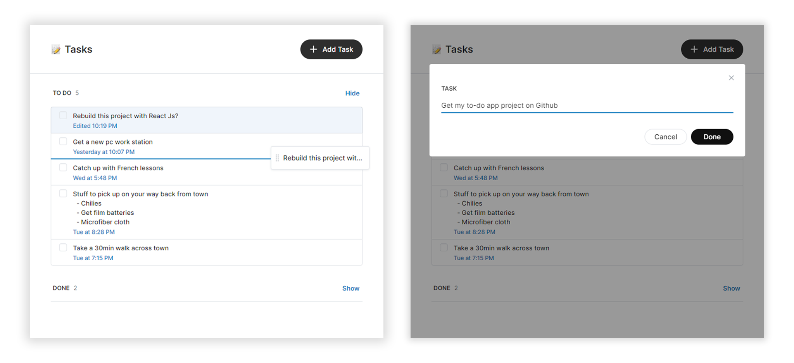
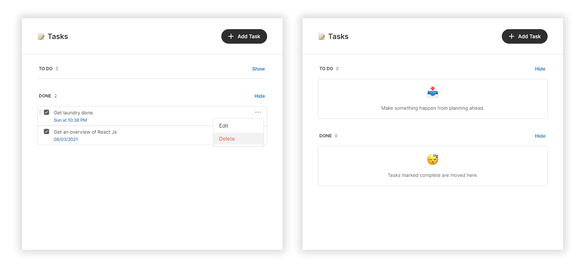

# to-do

This is a practice project done with JavaScript, CSS (Sass) and [Parcel](https://parcel.org). This was a shot at better understanding JS DOM manipulation, importing and use of npm packages ([date-fns](https://github.com/date-fns/date-fns) and [uuid](https://github.com/uuidjs/uuid)) and also making use of a web application bundler to transcompile code.

## File Structure

### HTML

Root `index.html`

### CSS

All CSS (Sass) files are indexed at `src > styles > main.scss`.

### JavaScript

All JS files are indexed at `src > js > main.js`.

## Building

### Development

Install dependencies via `npm install`

Run `npm run serve` to serve locally on `http://localhost:5024`
